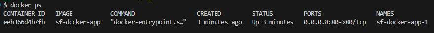
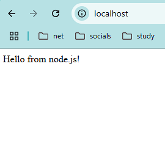

# Практическое задание Docker

### [Исходный код](./app/src//app.js)

### [Dockerfile](./app/Dockerfile)

### Сборка образа + запуск контейнера

```bash
  docker-compose up --build
```

### ID запущенного контейнера + список всех запущенных контенеров



### Скриншот работающего приложения в браузере

